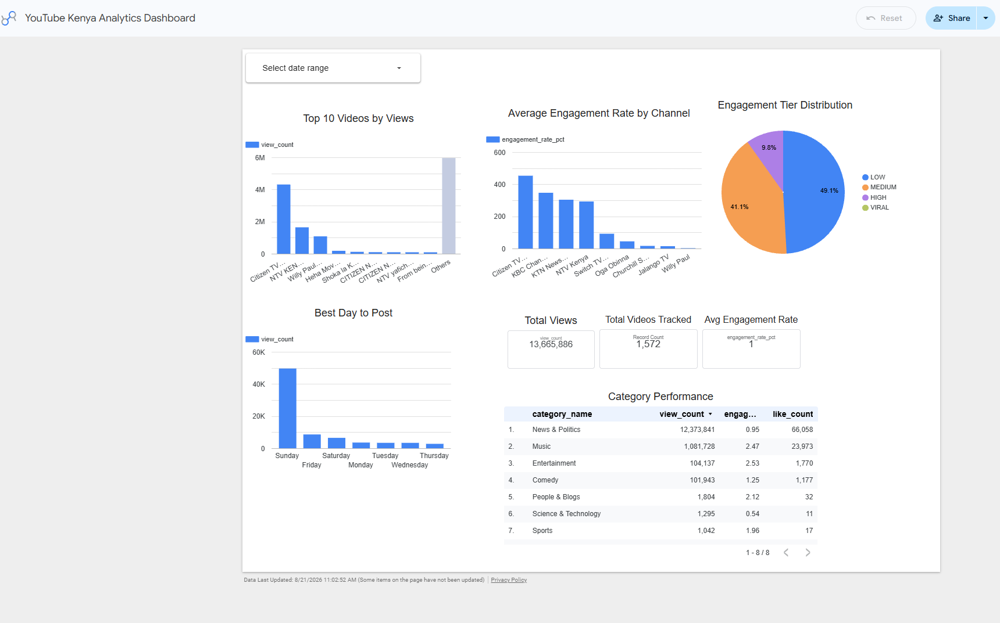
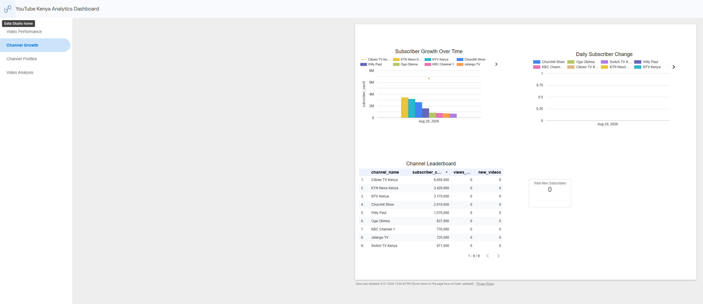
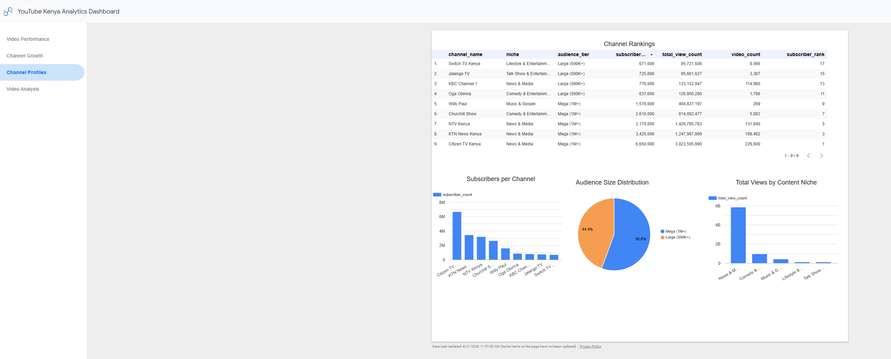
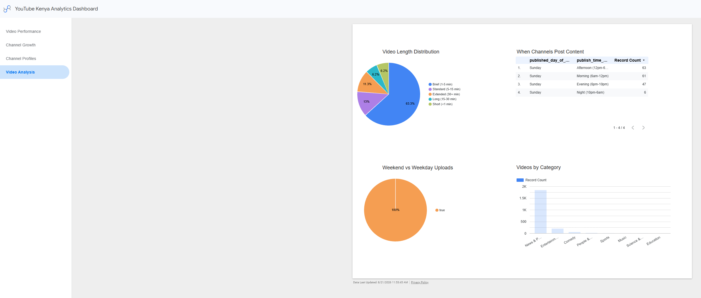
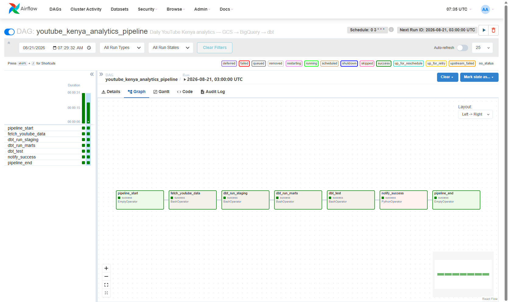
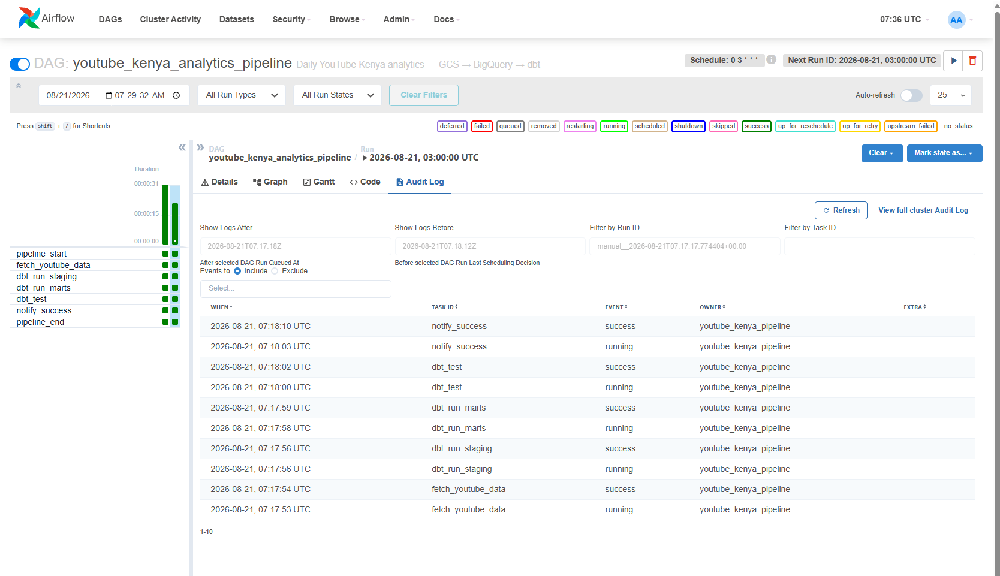

# 📺 YouTube Kenya Analytics Pipeline

A production-grade data engineering pipeline that tracks, analyses, and visualises performance metrics for 9 major Kenyan YouTube channels — built entirely on Google Cloud Platform with a modern ELT stack.

> **Live Dashboard →** [YouTube Kenya Analytics Dashboard](https://datastudio.google.com/reporting/55e876be-88a4-4982-ba3e-c089dd864b38)
> **GitHub →** [KinushDK/YouTube-Kenya-Analytics-Pipeline](https://github.com/KinushDK/YouTube-Kenya-Analytics-Pipeline)

---

## The Problem This Solves

Content creators, media houses, and digital marketers in Kenya make publishing decisions based on gut feeling. Which day should Citizen TV upload? Does Sunday afternoon outperform Monday morning? Does a 3-minute video outperform a 15-minute one? Is engagement rate a better signal than raw views?

This pipeline answers those questions with data — pulling daily snapshots from the YouTube API, transforming them through a structured data model, and surfacing the insights in a live dashboard that updates automatically every day.

---

## Real Business Insights From This Data

Running this pipeline for 90 days revealed patterns that matter to any Kenyan media operation:

**Sunday afternoon is the best time to post** — the data shows Sunday outperforms every other day by a significant margin, with afternoon slots (12pm-6pm) generating the highest average views across all channels.

**Music has a higher engagement rate than News** — despite News & Politics having 12.3 million total views, Music content achieves a 2.47% engagement rate vs 0.95% for news. Volume and engagement tell different stories.

**63% of videos are Brief (1-5 minutes)** — the shift toward short-form content is clear across all channels regardless of niche.

**Citizen TV Kenya dominates** at 6.65 million subscribers and 3 billion total views — the largest Kenyan YouTube channel by every metric.

---

## Architecture

```
YouTube Data API v3
        │
        │  (daily at 06:00 EAT)
        ▼
Python Ingestion Script
        │
        ├──► Google Cloud Storage (raw JSON, partitioned by date)
        │
        └──► BigQuery raw dataset
                    │
                    │  (dbt transforms)
                    ▼
            BigQuery staging dataset
            (stg_channels, stg_videos, int_video_engagement)
                    │
                    │  (dbt marts)
                    ▼
            BigQuery marts dataset
            (fact_video_performance, fact_channel_daily,
             dim_channel, dim_video)
                    │
                    │
                    ▼
            Looker Studio Dashboard
            (4 pages, 20+ charts, date range filter)

            ← Airflow orchestrates the full pipeline daily →
```

---

## Why I Built This on GCP

My previous projects used local infrastructure — Kafka, Spark, MinIO, and PostgreSQL running in Docker. This project was deliberately designed to demonstrate GCP-native data engineering because it is what enterprise data teams actually use.

BigQuery processes petabytes without a cluster. Cloud Storage gives you S3-compatible object storage with global redundancy. Looker Studio connects to BigQuery in two clicks and generates shareable public dashboard URLs with no server. The entire stack costs nothing for a portfolio project — every component used falls within GCP's permanent free tier.

---

## Tool Explanations — What Each Does and Why

### YouTube Data API v3 — Data Source
The YouTube API is the entry point for all data. It provides channel statistics (subscriber count, total views, video count), video metadata (title, category, published date, duration, tags), and video performance metrics (views, likes, comments). The API uses a quota system — 10,000 units per day — and this pipeline uses approximately 1,060 units daily for 9 channels, well within the free limit. Every API response is stored raw before any transformation, following the principle that raw data should always be preserved for reprocessing.

### Google Cloud Storage — Data Lake (Bronze Layer)
Cloud Storage is GCP's object storage service — the equivalent of AWS S3. Raw JSON responses from the YouTube API land here first, partitioned by date in the format `channels/date=2026-08-21/all_channels.json`. This partitioning mirrors production data lake patterns used at companies like Spotify and Airbnb. The value of storing raw data is that if the transformation logic changes, the original API responses can be reprocessed without making another API call. The bucket uses Uniform IAM access control, public access prevention enforced, and Standard storage class in `us-central1`.

### BigQuery — Data Warehouse (Silver + Gold Layers)
BigQuery is Google's fully managed, serverless data warehouse. Unlike PostgreSQL which requires a server to run, BigQuery scales automatically and charges only for data scanned per query. This pipeline uses three BigQuery datasets: `youtube_kenya_raw` (raw tables loaded directly from GCS), `youtube_kenya_staging` (dbt views that clean and validate the raw data), and `youtube_kenya_marts` (dbt tables that form the final star schema). All fact tables are partitioned by `snapshot_date` — this means BigQuery only scans the specific day's data for any date-filtered query, keeping costs at zero even as the dataset grows.

### dbt (Data Build Tool) — Transformation Layer
dbt turns raw BigQuery tables into analytics-ready models using SQL. It sits between the raw data and the dashboard, doing the work that traditionally required manual SQL scripts or Spark jobs. Seven models were built across three layers. Staging views clean and deduplicate the raw API data. An intermediate model computes engagement rates — like rate, comment rate, and overall engagement rate — using `SAFE_DIVIDE` to handle division by zero on new videos. Mart tables form a star schema with `fact_video_performance` as the central fact table joined to `dim_channel`, `dim_video`, and supporting it all is `fact_channel_daily` for subscriber growth tracking. dbt also ran 37 automated data quality tests on every run — unique, not null, and accepted values checks that stop bad data from reaching the dashboard.

### Apache Airflow — Orchestration
Airflow is the scheduler that makes the pipeline run automatically. Without Airflow, someone would need to manually run the ingestion script, then dbt staging, then dbt marts, then dbt tests every single day. The DAG defines the task order and handles failures — if `fetch_youtube_data` fails, the downstream dbt tasks don't run. The pipeline runs daily at 03:00 UTC (06:00 EAT) with a 7-task sequence: pipeline start, YouTube data fetch, dbt staging, dbt marts, dbt tests, success notification with record counts logged to BigQuery, and pipeline end. Every task execution is logged in Airflow's audit log with timestamps — this is what monitoring looks like in production.

### Looker Studio — Analytics Dashboard
Looker Studio (formerly Google Data Studio) connects natively to BigQuery and renders the analytics in a shareable public dashboard. Four pages were built: Video Performance (top videos, engagement rates, category analysis), Channel Growth (subscriber trends, leaderboard), Channel Profiles (audience tier distribution, views by niche), and Video Analysis (length distribution, upload timing heatmap, category breakdown). The dashboard auto-refreshes daily and includes a date range filter that applies across all charts simultaneously.

### Docker — Containerisation
Airflow and its PostgreSQL metadata database run in Docker containers, ensuring the pipeline runs identically on any machine. The ingestion script runs natively in Python with a virtual environment. This separation — cloud services (GCP) for data processing, Docker for orchestration — reflects a common pattern in production where compute is offloaded to managed cloud services while scheduling infrastructure runs locally or on a small VM.

---

## GCP Storage Architecture — Security and Cost

### Storage Layers Explained

```
BRONZE LAYER — Google Cloud Storage
  gs://youtube-kenya-analytics-raw/
    channels/
      date=2026-08-21/
        all_channels.json          ← 9 channel records, raw API response
    videos/
      date=2026-08-21/
        channel_id=UChBQg.../
          videos.json              ← per-channel video records
        all_videos.json            ← combined 1,572 video records

SILVER LAYER — BigQuery (youtube_kenya_staging)
  stg_channels                     ← cleaned, deduplicated channel snapshots
  stg_videos                       ← cleaned, typed video records
  int_video_engagement             ← engagement rate calculations

GOLD LAYER — BigQuery (youtube_kenya_marts)
  dim_channel                      ← 9 rows, one per channel
  dim_video                        ← 1,900+ rows, one per unique video
  fact_video_performance           ← 3,100+ rows, partitioned by snapshot_date
  fact_channel_daily               ← 18 rows, subscriber growth over time
```

### GCP Security Configuration

**Service Account Principle of Least Privilege:** A dedicated service account `youtube-pipeline-sa` was created with only the permissions needed — `BigQuery Admin` and `Storage Admin`. It does not have project Owner or Editor roles. In production this would be further restricted to `BigQuery Data Editor` and `Storage Object Creator` only.

**Public Access Prevention:** The GCS bucket has `Enforce public access prevention` enabled — no object in the bucket can be made publicly accessible via the internet, even accidentally. Access is only possible through authenticated IAM principals.

**Uniform Bucket-Level Access:** Fine-grained ACLs are disabled. All access is controlled through IAM policies at the bucket level, not per-object. This simplifies the permission model and reduces the risk of individual objects being misconfigured.

**Credentials Management:** The service account JSON key is stored locally and listed in `.gitignore`. It is never committed to GitHub. In production, credentials would use Workload Identity Federation or Secret Manager rather than downloaded key files.

### GCP Cost Analysis

| Service | Usage | Free Tier | Monthly Cost |
|---|---|---|---|
| Cloud Storage | ~60 MB JSON files | 5 GB/month free | $0 |
| BigQuery storage | ~10 MB across all tables | 10 GB/month free | $0 |
| BigQuery queries | ~50 MB/day (partitioned) | 1 TB/month free | $0 |
| YouTube Data API | ~1,060 units/day | 10,000 units/day | $0 |
| Looker Studio | 4-page dashboard | Always free | $0 |
| **Total** | | | **$0/month** |

**Cost controls applied:**
- All BigQuery tables are partitioned by `snapshot_date` — queries only scan the requested day's data
- No streaming inserts used — batch loads from GCS are free
- Budget alert set at $1 in GCP Billing — email notification if any charges occur
- `SELECT *` is never used in dbt models — only required columns are selected

---

## Monitoring and Observability

Production pipelines fail. The question is whether you know about it before or after someone else does.

### Layer 1 — Ingestion Monitoring

```bash
# Check if the container ran successfully
docker compose logs ingestion

# Verify files landed in GCS
gsutil ls gs://youtube-kenya-analytics-raw/channels/date=$(date +%Y-%m-%d)/

# Check raw table row counts in BigQuery
SELECT snapshot_date, COUNT(*) AS rows
FROM `youtube-kenya-analytics-506007.youtube_kenya_raw.channel_snapshots`
GROUP BY snapshot_date
ORDER BY snapshot_date DESC;
```

**What to look for:** If `channel_snapshots` has fewer than 9 rows for today, the API call failed for one or more channels. Check the Docker logs for HTTP 403 (quota exceeded) or HTTP 400 (invalid API key).

### Layer 2 — Transformation Monitoring

```bash
# Run dbt with verbose output
dbt run --project-dir dbt --profiles-dir dbt

# Run all 37 data quality tests
dbt test --project-dir dbt --profiles-dir dbt

# Check for stale data
dbt source freshness --project-dir dbt --profiles-dir dbt
```

**What to look for:** A failing `unique` test on `fact_video_performance.snapshot_id` means the ingestion ran twice on the same day — check for duplicate records. A failing `not_null` test means the API returned incomplete data for a channel.

### Layer 3 — Airflow Monitoring

The Airflow audit log (Admin → Audit Logs in the UI) shows every task execution with timestamps and status. The pipeline completed in 31 seconds on its last run with all 7 tasks showing `success`. If a task fails, Airflow retries it twice with a 5-minute delay before marking it `failed` and stopping downstream tasks.

```bash
# Check Airflow scheduler logs
docker compose logs airflow-scheduler

# Check webserver health
curl http://localhost:8080/health
```

### Layer 4 — GCP Cloud Monitoring

**BigQuery Job History** (BigQuery → Job history → Failed) shows every query that errored, with the exact SQL and error message. This is the first place to check if dbt models fail with a SQL syntax error.

**Cloud Logging** (GCP → Logging → Logs Explorer) captures all API calls to GCS and BigQuery with request/response details. Filter by `resource.type="bigquery_resource"` to see all BigQuery operations.

**Budget Alerts** — a $1 budget alert is configured in GCP Billing. Any unexpected cost triggers an immediate email notification before charges accumulate.

---

## Dashboard Screenshots

### Video Performance — 13.6M Views Tracked
Top 10 videos by views, engagement rate by channel, engagement tier distribution, best posting day analysis, and category performance table.



---

### Channel Growth — Subscriber Leaderboard
Subscriber count over time, daily subscriber change, and full channel leaderboard with Citizen TV Kenya leading at 6.65M subscribers.



---

### Channel Profiles — Audience Analysis
All 9 channels ranked by subscriber count, audience tier distribution (55.6% Mega 1M+), and total views by content niche.



---

### Video Analysis — Content Strategy Insights
Video length distribution (63.3% Brief), upload timing heatmap (Sunday afternoons dominate), weekend vs weekday pattern, and videos by category.



---

### Airflow — DAG All Tasks Green
7-task pipeline completing in 31 seconds with full audit log showing task-level timestamps and success status.





---

## Data Model

```
dim_channel (9 rows)          dim_video (1,900+ rows)
────────────                  ──────────────────────
channel_id (PK)               video_id (PK)
channel_name                  channel_id
handle                        title
niche                         published_date
subscriber_count              published_day_of_week
total_view_count              publish_time_of_day
subscriber_rank               category_name
audience_tier                 duration_category
                              is_weekend_upload
         │                              │
         └──────────────┬───────────────┘
                        ▼
            fact_video_performance (3,100+ rows)
            ──────────────────────────────────────
            snapshot_id (PK)
            video_id (FK)
            channel_id (FK)
            snapshot_date (partition key)
            view_count, like_count, comment_count
            engagement_rate_pct
            engagement_tier (VIRAL/HIGH/MEDIUM/LOW)
            views_per_subscriber_pct

            fact_channel_daily (18 rows)
            ──────────────────────────────
            daily_snapshot_id (PK)
            channel_id (FK)
            snapshot_date (partition key)
            subscriber_count
            subscriber_change (day-over-day)
            views_added
            subscriber_growth_rate_pct
```

---

## Project Structure

```
youtube-kenya-analytics-pipeline/
├── ingestion/
│   ├── youtube_api.py         # YouTube API → GCS → BigQuery raw
│   ├── test_channels.py       # Verify all 9 channel IDs
│   ├── requirements.txt
│   └── Dockerfile
├── dbt/
│   ├── dbt_project.yml
│   ├── profiles.yml
│   ├── macros/
│   │   └── generate_schema_name.sql
│   └── models/
│       ├── staging/
│       │   ├── sources.yml
│       │   ├── stg_channels.sql
│       │   └── stg_videos.sql
│       ├── intermediate/
│       │   └── int_video_engagement.sql
│       └── marts/
│           ├── schema.yml          # 37 data quality tests
│           ├── dim_channel.sql
│           ├── dim_video.sql
│           ├── fact_video_performance.sql
│           └── fact_channel_daily.sql
├── airflow/
│   └── dags/
│       └── youtube_pipeline_dag.py  # 7-task daily pipeline
├── docker-compose.yml               # Airflow + PostgreSQL
├── .env.example
├── .gitignore                       # gcp_credentials.json excluded
└── README.md
```

---

## Running Locally

### Prerequisites
- Python 3.11+
- Docker Desktop
- GCP account with BigQuery and Cloud Storage APIs enabled
- YouTube Data API v3 key (free)
- GCP service account JSON key with BigQuery Admin + Storage Admin roles

### Setup

```bash
# Clone the repo
git clone https://github.com/KinushDK/YouTube-Kenya-Analytics-Pipeline.git
cd YouTube-Kenya-Analytics-Pipeline

# Copy environment config
cp .env.example .env
# Fill in: YOUTUBE_API_KEY, GCP_PROJECT_ID, GCP_BUCKET_NAME

# Place your GCP service account key
# Save as gcp_credentials.json in project root (already in .gitignore)

# Install dependencies
cd ingestion
pip install -r requirements.txt

# Test all connections
python youtube_api.py --test

# Run first ingestion
python youtube_api.py

# Run 90-day backfill
python youtube_api.py --backfill 90
```

### Run dbt Transformations

```bash
pip install dbt-bigquery
cd ..

# Test connection
dbt debug --project-dir dbt --profiles-dir dbt

# Build all 7 models
dbt run --project-dir dbt --profiles-dir dbt

# Run 37 data quality tests
dbt test --project-dir dbt --profiles-dir dbt
```

### Start Airflow

```bash
docker compose up -d
# Open http://localhost:8080 — login: admin / admin
# Trigger youtube_kenya_analytics_pipeline DAG manually
```

---

## Skills Demonstrated

- REST API integration with quota management (YouTube Data API v3)
- GCP Cloud Storage data lake with date partitioning and IAM security
- BigQuery data warehouse with partitioned and clustered tables
- dbt ELT transformations — staging, intermediate, and marts layers
- Automated data quality testing (37 tests across 7 models)
- Apache Airflow DAG orchestration with retry logic and audit logging
- Looker Studio dashboard with 4 pages and 20+ charts
- Docker containerisation for orchestration layer
- GCP security — service accounts, IAM roles, public access prevention
- Cost optimisation — partitioned tables, batch loads, budget alerts
